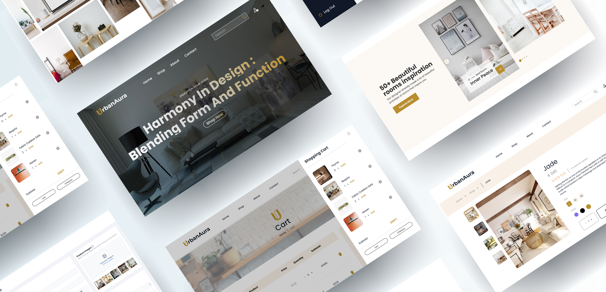

# UrbanAura E-Commerce Frontend

Welcome to the [UrbanAura](https://urbanaurafurniture.web.app/) E-Commerce Frontend repository! This is the Frontend of the UrbanAura e-commerce platform, built using the MERN Stack (MongoDB, ExpressJS, React, NodeJS). Check out the backend repository [here](https://github.com/roufhasan/urbanAura-server).



## Table of Contents

- [Project Link](#project-links)

- [About the Project](#about-the-project)

- [Features](#features)

- [Security](#security)

- [Technologies Used](#technologies-used)

- [Installation](#installation)

- [Usage](#usage)

- [Contact](#contact)

## Project Links

Backend Repository: [UrbanAura Client](https://github.com/roufhasan/urbanAura-server)

Live Link: [Click here](https://urbanaurafurniture.web.app/) or visit https://urbanaurafurniture.web.app

## About the Project

The Frontend of [UrbanAura](https://urbanaurafurniture.web.app/) is crafted to offer users an intuitive and engaging shopping experience. Built with React.js, it leverages various modern libraries and frameworks to enhance usability and performance. Users can authenticate via Firebase, manage their carts, add favourites, track orders, and securely process payments through Stripe. The interface is styled using Tailwind CSS and DaisyUI, with additional interactive elements powered by Headless UI, Framer Motion, and SwiperJS. The debounce method ensures Efficient API handling with Axios and optimized product searches. User and admin routes are secured through JWT verification with axiosSecure, maintaining a high standard of security across the platform.

## Features

### User Features

- **Authentication:**

  - Login, Sign-up, and Account Deletion using Firebase Authentication.
  - Profile image and name updates.

- **Cart Management:**

  - Add or remove items and update item quantity in the cart.

- **Favorites:**

  - Add favourite items for easy access.

- **Order Tracking:**

  - Track ordered items and view order history.

- **Payment:**

  - Secure payment processing for cart items using Stripe.

- **Reviews:**

  - Verified product purchasers can submit and delete reviews on purchased products.

- **Product Search:**

  - Debounce method for efficient API calls during product search.

- **Carousel:**
  - Custom beautiful carousel at the top of the page using SwiperJS.

### Admin Features

- **Dashboard:**

  - Overview of orders, sales, and costs with static charts.

- **Order Management:**

  - View all orders, update order status, or cancel orders.
  - View detailed information on individual orders.

- **Product Management:**
  - View all products, update product information, or delete products.
  - Add new products with image upload functionality.

### Security

- **Frontend Security:**

  - Frontend secured using JWT verification for both users and admins with axiosSecure.

- **Backend Security:**

  - Admin routes are secured for admins.
  - User routes are secured for authenticated users.

## Technologies Used

- **Frontend:**

  - React.js
  - Firebase Authentication
  - Axios
  - axiosSecure for JWT verification
  - Tailwind CSS
  - DaisyUI
  - Headless UI
  - Framer Motion
  - SwiperJS
  - React Hook Form
  - Stripe

- **Backend:**

  - Node.js
  - Express.js
  - MongoDB
  - Stripe for payment processing

## Installation

To get a local copy up and running, follow these steps:

1. **Clone the repository:**

```sh
git clone https://github.com/roufhasan/urbanAura-client.git
```

2. **Install dependencies**

```sh
cd urbanAura-client
npm install
```

3. **Set up environment variables**

Create a `.env.local` file in the root directory and add your necessary keys for `firebase.config.js`, Stripe payment gateway in `BillingDetails.jsx`, and Imgbb image upload API key in `AccountSettings.jsx` and `imageUpload.js` utils.

4. **Start the server**

```sh
npm run dev
```

## Usage

**Clone the Backend Server:**

- To run the client side properly, you need to first clone the [UrbanAura Server](https://github.com/roufhasan/urbanAura-server) from this [repository](https://github.com/roufhasan/urbanAura-server). Further instructions are provided in that repository.

**Testing the Frontend:**

- Ensure the backend server is running.

- Use the application to test functionalities like login, signup, cart management, order tracking, and payments.

- Note that some features like adding, updating, and deleting items require the backend to be properly configured and running.

**Environment Variables:**

- Configure necessary environment variables in the `.env.local` file for Firebase, Stripe, and Imgbb as mentioned in the [installation](#installation) section.

## Contact

**Email**: [roufhasan5@gmail.com](mailto:roufhasan5@gmail.com)

**LinkedIn**: [www.linkedin.com/in/rouf-hasan-hridoy](www.linkedin.com/in/rouf-hasan-hridoy)

**Portfolio**: [https://roufhasanhridoy.netlify.app/](https://roufhasanhridoy.netlify.app/)
